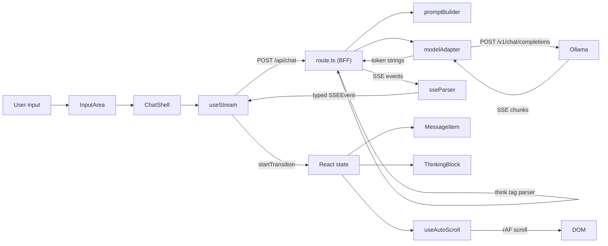
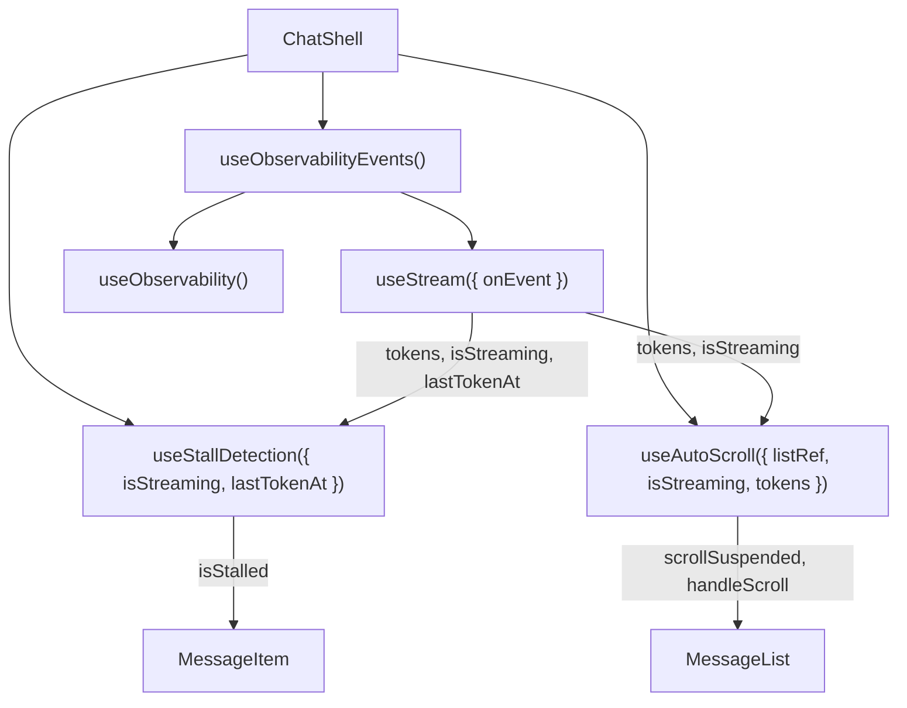

# Maude

"Marc's Claude" -- a pedagogical LLM chat application where every architectural
decision is designed to make frontend streaming patterns visible, exercisable,
and explainable. This is a teaching instrument, not a product.

## Tech stack

| Layer | Technology |
|-------|-----------|
| Framework | Next.js 16 (App Router, server + client components) |
| UI | React 19 (concurrent features, React Compiler) |
| Language | TypeScript (strict mode, no `any`) |
| Database | SQLite via better-sqlite3 (synchronous, local file) |
| LLM backend | Ollama (OpenAI-compatible `/v1/chat/completions`) |
| Linting/formatting | Biome |
| Unit tests | Jest + React Testing Library + MSW 2.0 |
| E2E tests | Playwright + MSW browser service worker |
| Styling | Tailwind CSS |
| Markdown | react-markdown + remark-gfm |
| Package manager | pnpm |

## Key concepts glossary

**BFF (Backend-for-Frontend)** -- The `/api/chat` route
([`src/app/api/chat/route.ts`](src/app/api/chat/route.ts)) acts as a thin
translator between Ollama's OpenAI-compatible streaming format and an
Anthropic-inspired SSE event protocol. The client never knows which LLM
backend is running. The BFF also handles thinking-tag parsing, conversation
persistence, and abort signal propagation.

**SSE (Server-Sent Events)** -- The wire format between server and client.
The BFF writes `data: <json>\n\n` lines; the client's SSE parser
([`src/lib/client/sseParser.ts`](src/lib/client/sseParser.ts)) reads them
via an async generator that yields typed `SSEEvent` objects. Chunk boundary
handling (partial lines, split multi-byte UTF-8 characters) is the core
complexity.

**Discriminated union** -- `SSEEvent`
([`src/lib/client/events.ts`](src/lib/client/events.ts)) is a TypeScript
union type where each variant has a unique `type` field (`message_start`,
`content_block_delta`, `error`, etc.). This enables exhaustive `switch`
statements -- TypeScript flags unhandled event types at compile time.

**`startTransition`** -- Used in `useStream`
([`src/hooks/useStream.ts`](src/hooks/useStream.ts)) to mark token
accumulation as non-urgent. This tells React 19 that rendering the next
token is lower priority than user interactions (clicking Stop, scrolling).
Without it, 30-50 tokens/sec would make the UI unresponsive. This is NOT
the navigation use case -- it is a streaming content priority technique.

**Thinking block** -- Models like DeepSeek-R1 and Qwen emit reasoning in
`<think>`/`</think>` tags. The BFF runs a state machine
([`src/app/api/chat/route.ts`](src/app/api/chat/route.ts), `processBuffer`)
that splits raw tokens into thinking vs. content chunks, handling tags that
straddle token boundaries. The model adapter
([`src/lib/server/modelAdapter.ts`](src/lib/server/modelAdapter.ts)) also
wraps Ollama's `reasoning_content` field in think tags for models that use
the structured field instead of inline tags.

**Stall detection** -- `useStallDetection`
([`src/hooks/useStallDetection.ts`](src/hooks/useStallDetection.ts)) sets a
single `setTimeout` (8 seconds) on each token arrival. If no token arrives
before the timeout fires, `isStalled` becomes true and the UI shows a "Still
working..." indicator. Not polling -- a single timer that resets per token.

**MSW (Mock Service Worker)** -- All tests run without Ollama.
[`src/mocks/`](src/mocks/) contains handler files that produce deterministic
SSE responses. Jest tests use MSW's `server.use()` for module-level
interception. Playwright E2E tests activate handlers in the browser via
string keys through `window.__msw.use('normal')` -- string keys because
`page.evaluate()` cannot serialize function references.

**`server-only` boundary** --
[`src/lib/server/modelAdapter.ts`](src/lib/server/modelAdapter.ts),
[`src/lib/server/db.ts`](src/lib/server/db.ts), and
[`src/lib/server/promptBuilder.ts`](src/lib/server/promptBuilder.ts) all
`import 'server-only'`. This is a Next.js build-time firewall -- the bundler
throws an error if any client component transitively imports these modules.
Not a runtime check.

**Async generator** -- Both the model adapter's `tokenStream` and the
client's `parseSSEStream` use `async function*` to yield values as they
arrive from a `ReadableStream`. Consumers use `for await...of` loops, which
compose cleanly and return naturally when the stream ends.

## End-to-end data flow

Here is what happens when a user types a message and presses Enter:

1. **`InputArea`** ([`src/components/chat/InputArea.tsx`](src/components/chat/InputArea.tsx))
   fires `onSubmit` with the text. `ChatShell`
   ([`src/components/chat/ChatShell.tsx`](src/components/chat/ChatShell.tsx))
   adds the user message to local `history` state and calls `send()`.

2. **`useObservabilityEvents`** ([`src/hooks/useObservabilityEvents.ts`](src/hooks/useObservabilityEvents.ts))
   wraps `useStream` and emits a `message_sent` event to the debug pane before
   delegating to `useStream.send()`.

3. **`useStream`** ([`src/hooks/useStream.ts`](src/hooks/useStream.ts))
   creates an `AbortController`, POSTs the messages array to `/api/chat`, and
   enters a `for await...of` loop over the SSE parser's async generator.

4. **BFF route** ([`src/app/api/chat/route.ts`](src/app/api/chat/route.ts))
   validates the request, reads user settings from SQLite, composes a system
   prompt via `promptBuilder`, and calls `streamCompletion` on the model adapter.

5. **`modelAdapter`** ([`src/lib/server/modelAdapter.ts`](src/lib/server/modelAdapter.ts))
   opens a streaming POST to Ollama's `/v1/chat/completions` endpoint. Its
   async generator yields raw token strings. It wraps `reasoning_content`
   fields in `<think>`/`</think>` tags for structured-thinking models.

6. **Thinking-tag parser** (in `route.ts`) runs a state machine over the token
   stream, splitting tokens into `thinking_start`, `thinking`, `thinking_stop`,
   and `content` chunks. The `ChunkDispatcher` translates those chunks into
   typed SSE events and enqueues them on the `ReadableStream` controller.

7. **`sseParser`** ([`src/lib/client/sseParser.ts`](src/lib/client/sseParser.ts))
   reads the response body byte-by-byte, splits on `\n`, extracts `data:`
   lines, parses JSON, and yields typed `SSEEvent` objects.

8. **`useStream`** dispatches each event in a `switch/case`:
   - `content_block_delta`: accumulates tokens in state (inside
     `startTransition` so rendering is non-blocking) and updates `lastTokenAt`
   - `thinking_delta`: accumulates reasoning text (also in `startTransition`)
   - `message_stop`: sets `isStreaming: false`, calls `onComplete` with final
     results including the server-assigned `conversationId`
   - `error`: surfaces the error message in state

9. **React renders** the updated state: `MessageItem` shows the growing text
   via `StreamingMarkdown`, `ThinkingBlock` shows reasoning, and
   `useAutoScroll` ([`src/hooks/useAutoScroll.ts`](src/hooks/useAutoScroll.ts))
   scrolls to the bottom using `requestAnimationFrame` to coalesce scroll
   updates per display frame.

10. **On completion**, `ChatShell.appendAssistant` adds the finalized message
    to history, updates the URL to `/chat/{conversationId}` via
    `history.replaceState`, and bumps `historyRefreshToken` so `HistoryPane`
    re-fetches the conversation list.

## Architecture diagrams

### Data flow



### Module dependencies

```mermaid
flowchart TD
    subgraph Server
        route["api/chat/route.ts"]
        convRoute["api/conversations/route.ts"]
        settingsRoute["api/settings/route.ts"]
        modelAdapter["lib/server/modelAdapter.ts"]
        promptBuilder["lib/server/promptBuilder.ts"]
        db["lib/server/db.ts"]
        apiHelpers["lib/server/apiHelpers.ts"]
    end

    subgraph Client
        ChatShell["components/chat/ChatShell.tsx"]
        InputArea["components/chat/InputArea.tsx"]
        MessageItem["components/chat/MessageItem.tsx"]
        MessageList["components/chat/MessageList.tsx"]
        ThinkingBlock["components/chat/ThinkingBlock.tsx"]
        StreamingMarkdown["components/chat/StreamingMarkdown.tsx"]
        HistoryPane["components/layout/HistoryPane.tsx"]
        ObservabilityPane["components/layout/ObservabilityPane.tsx"]
        SettingsForm["components/settings/SettingsForm.tsx"]
    end

    subgraph Hooks
        useStream["hooks/useStream.ts"]
        useObsEvents["hooks/useObservabilityEvents.ts"]
        useAutoScroll["hooks/useAutoScroll.ts"]
        useStallDetection["hooks/useStallDetection.ts"]
    end

    subgraph Shared
        events["lib/client/events.ts"]
        sseParser["lib/client/sseParser.ts"]
        sharedTypes["lib/shared/types.ts"]
        ObsContext["context/ObservabilityContext.tsx"]
    end

    route --> modelAdapter
    route --> promptBuilder
    route --> db
    route --> apiHelpers
    route --> events
    convRoute --> db
    settingsRoute --> db

    ChatShell --> useObsEvents
    ChatShell --> useAutoScroll
    ChatShell --> useStallDetection
    ChatShell --> InputArea
    ChatShell --> MessageItem
    ChatShell --> MessageList
    ChatShell --> ThinkingBlock
    ChatShell --> HistoryPane
    ChatShell --> ObservabilityPane
    ChatShell --> ObsContext

    useObsEvents --> useStream
    useObsEvents --> ObsContext
    useStream --> sseParser
    sseParser --> events

    db --> sharedTypes
    HistoryPane --> sharedTypes
    SettingsForm --> sharedTypes
```



### Hook composition in ChatShell



## Pages and routes

### Pages

| Route | Component | Type | Description |
|-------|-----------|------|-------------|
| `/` | `WelcomePage` | Server | Static welcome page with links to chat and settings |
| `/chat` | `ChatPage` -> `ChatShell` | Server -> Client | Three-column chat: history, messages, observability |
| `/chat/[id]` | `ChatByIdPage` -> `ChatShell` | Server -> Client | Pre-fetches conversation + messages from SQLite |
| `/settings` | `SettingsPage` -> `SettingsForm` | Server -> Client | User name and personalization prompt |

### API routes

| Endpoint | Description |
|----------|-------------|
| `POST /api/chat` | SSE streaming -- translates Ollama tokens to typed SSE events |
| `GET /api/conversations` | List all conversations (ordered by `updated_at` DESC) |
| `GET /api/conversations/[id]` | Load messages for a specific conversation |
| `DELETE /api/conversations/[id]` | Delete a conversation and its messages (CASCADE) |
| `GET /api/settings` | Read user settings from SQLite |
| `PUT /api/settings` | Update user settings |

## What this project deliberately does NOT do

Each omission is a conscious design choice, not an oversight:

- **No reconnection/retry on stream failure.** If the SSE stream drops, the
  user must retry manually. A production app would add automatic reconnection
  with exponential backoff. The simplification keeps the streaming state
  machine in `useStream` focused on the happy path and one-shot error cases.

- **No TransformStream pipeline.** The BFF writes SSE events imperatively
  inside a `ReadableStream.start()` callback. A TransformStream chain would
  split the logic across `transform()` and `flush()` callbacks, obscuring
  the sequential flow. The comment in `route.ts` explains this tradeoff.

- **No Zod runtime validation.** Request/response boundaries use manual
  TypeScript validation (`validateRequestBody` in `route.ts`). For a single
  streaming endpoint, manual checks are clearer and dependency-free.

- **No external state library.** All state lives in React hooks and context
  (`useState`, `useReducer`, `useRef`, `useContext`). No Zustand, Jotai, or
  Redux. The context is the event bus.

- **No RSC for the chat message stream.** The chat page shell IS a server
  component (it pre-fetches conversations from SQLite), but the streaming
  chat UI is a client component (`ChatShell`). Streaming tokens require
  `useState`, `useRef`, `AbortController`, and `startTransition` -- all
  client-only APIs.

- **SQLite, not Postgres.** `better-sqlite3` is synchronous and local-file.
  No connection pool, no async driver, no Docker dependency for the database.
  Trades scalability for simplicity.

- **No WebSocket upgrade.** SSE is unidirectional (server to client), which
  is exactly what token streaming needs. The client sends messages via
  regular POST requests. WebSocket would add bidirectional complexity for no
  benefit.

## Directory structure

```
src/
  app/                          # Next.js App Router pages and API routes
    api/
      chat/                     # POST /api/chat — SSE streaming BFF
      conversations/            # GET/DELETE conversation CRUD
        [id]/                   # Dynamic route for single conversation
      settings/                 # GET/PUT user settings
    chat/                       # /chat page (server component shell)
      [id]/                     # /chat/[id] page (pre-fetched conversation)
    settings/                   # /settings page (server component shell)
    layout.tsx                  # Root layout with ObservabilityProvider + MSWProvider
    page.tsx                    # Welcome page at /
  components/
    chat/                       # Chat UI components
      ChatShell.tsx             # Main client component — wires hooks to UI
      InputArea.tsx             # Message input with Enter/Shift+Enter handling
      MessageItem.tsx           # Single message bubble (user or assistant)
      MessageList.tsx           # Scrollable message container
      StreamingMarkdown.tsx     # Markdown rendering during and after streaming
      ThinkingBlock.tsx         # Collapsible reasoning trace disclosure
    layout/
      HistoryPane.tsx           # Left sidebar — conversation list
      ObservabilityPane.tsx     # Right sidebar — metrics, events, system prompt
    settings/
      SettingsForm.tsx          # Client form for name + personalization prompt
  context/
    ObservabilityContext.tsx     # In-memory event bus (useReducer-based)
  hooks/
    useAutoScroll.ts            # rAF-coalesced scroll-to-bottom during streaming
    useObservabilityEvents.ts   # Bridges useStream lifecycle to ObservabilityContext
    useStallDetection.ts        # 8-second timeout for token silence
    useStream.ts                # Core streaming hook — fetch, parse, accumulate
  lib/
    client/
      events.ts                 # SSEEvent discriminated union (API contract)
      sseParser.ts              # Async generator: ReadableStream -> SSEEvent
    server/
      apiHelpers.ts             # ValidationError + jsonResponse helper
      db.ts                     # SQLite access (better-sqlite3, server-only)
      modelAdapter.ts           # Ollama streaming (server-only, only env var reader)
      promptBuilder.ts          # System prompt composition (server-only)
      migrations/
        001_initial.sql         # Schema: settings, conversations, messages
    shared/
      types.ts                  # Domain types shared across server/client boundary
  mocks/
    browser.ts                  # MSW browser worker setup + string-key registry
    server.ts                   # MSW server setup for Jest tests
    handlerFactory.ts           # createSyncHandler factory for deterministic SSE
    utils.ts                    # SSE encoding utilities (jsdom-safe)
    handlers/                   # One file per scenario (normal, thinking, stall, etc.)
tests/
  e2e/                          # Playwright specs + fixtures
```

## Getting started

```bash
# Install dependencies
pnpm install

# Configure environment (Ollama must be running locally)
cp .env.example .env.local
# OLLAMA_BASE_URL=http://localhost:11434  (default)
# MODEL_NAME=gpt-oss:20b                 (default)

# Start dev server
pnpm dev

# Open http://localhost:3000/chat
```

## Testing

```bash
# Unit tests (Jest + MSW, no Ollama needed)
pnpm test
pnpm test:coverage

# E2E tests (Playwright, uses MSW browser worker)
pnpm test:e2e

# Type checking
pnpm type-check

# Lint + format
pnpm lint
pnpm lint:fix
```

## Milestones

| Milestone | Description | Status |
|-----------|-------------|--------|
| M0 | Dev environment setup | Done |
| M1 | Minimal viable chat -- streaming, cancellation, auto-scroll | Done |
| M2 | Streaming polish -- thinking blocks, markdown, stall detection | Done |
| M3 | Observability -- debug pane with metrics, events, system prompt | Done |
| M4 | Full app -- history, settings, welcome page, conversation API | Done |
| M5 | Server components -- settings and chat shell pre-fetch from SQLite | Done |

## Further reading

- [SPEC-v0.1.md](docs/SPEC-v0.1.md) -- Full specification covering architecture, UX,
  concurrent patterns, testing strategy, and enforcement rules
- [TASKS-v0.1.md](docs/TASKS-v0.1.md) -- Detailed build plan with 34 tasks across 5
  milestones, including dependencies and acceptance criteria
- [CLAUDE.md](CLAUDE.md) -- Project constitution: non-negotiable constraints,
  TDD workflow, commit format, and quality gates
